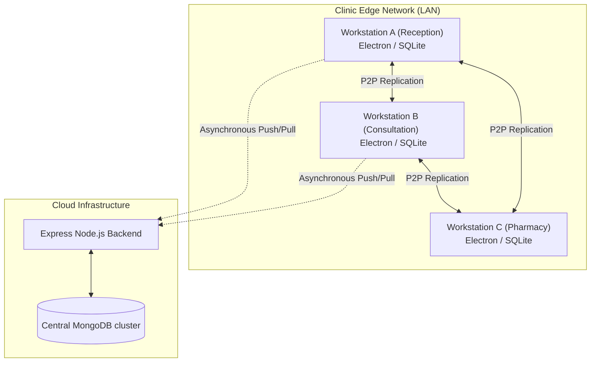
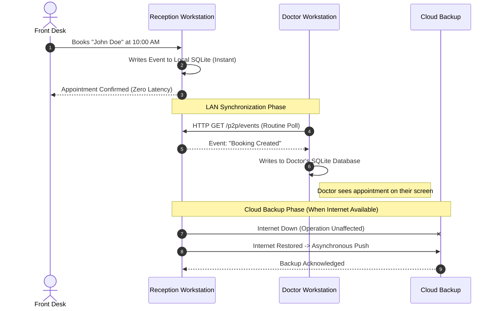
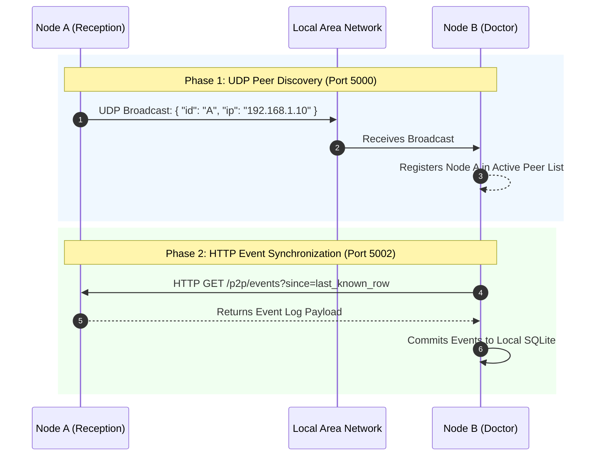
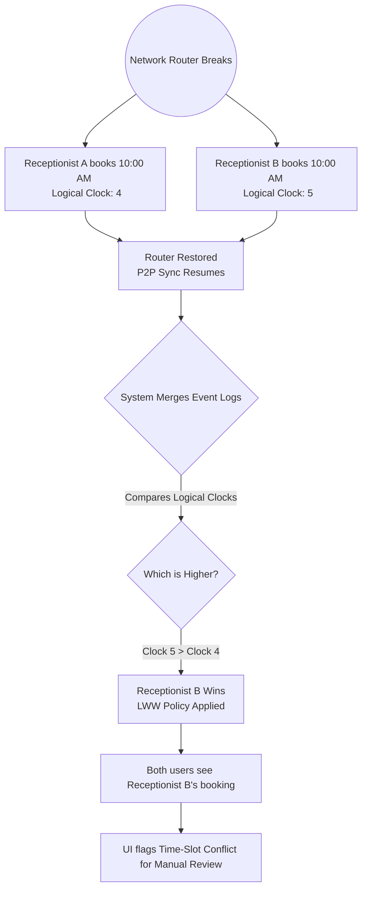

# System Architecture & Strategy Document
**Project:** ClinicFlow Platform
**Document Type:** Enterprise Architecture Review
**Version:** 1.0.0
**Target Audience:** Executive Management, Architecture Review Board, Technical Investors

---

## 1. Executive Summary

ClinicFlow is an enterprise-grade Practice Management System (PMS) engineered to deliver **100% operational uptime** in healthcare environments. Recognizing that internet infrastructure in clinics is often a single point of failure, ClinicFlow implements a **Local-First, Distributed Edge Architecture**. 

By decentralizing data storage and leveraging peer-to-peer (P2P) synchronization across the clinic's Local Area Network (LAN), the platform ensures that front-desk operations and clinical consultations can proceed uninterrupted during complete external network outages. When external connectivity is restored, the system seamlessly and asynchronously synchronizes with the central cloud infrastructure.

---

## 2. Business Value & Strategic Drivers

### 2.1 The Operational Challenge
Modern cloud-native clinical systems are highly vulnerable to internet latency and ISP outages. When cloud connectivity fails, clinical operations halt, resulting in severely degraded patient care, delayed billing, and significant revenue loss.

### 2.2 The ClinicFlow Advantage
- **Absolute Resilience**: Eliminates the internet as a dependency for daily clinical operations.
- **Zero-Latency Performance**: Read and write operations occur on local SSDs, providing sub-millisecond response times compared to traditional cloud latency.
- **Zero-IT Infrastructure**: Unlike traditional on-premise solutions requiring complex local server racks, ClinicFlow utilizes auto-discovery over the LAN, transforming standard staff workstations into a resilient distributed cluster.
- **Data Sovereignty & Compliance**: Patient data remains on-premises by default, minimizing the attack surface associated with pure-cloud platforms.

---

## 3. Architectural Blueprint

### 3.1 Design Paradigm
The platform is built on a **Local-First, Event-Sourced, Leaderless Distributed Architecture**. 
- There is no single "master node" within the clinic; all workstations operate as peer replicas.
- State mutations are recorded as immutable events (Event Sourcing) to ensure verifiable data integrity.

### 3.2 High-Level Context Diagram

### 3.3 End-to-End Operational Workflow

The following workflow illustrates a core business operation (scheduling a patient) executing seamlessly across the distributed network, completely independent of external cloud connectivity.

**Step-by-Step Explanation of the Workflow:**
1. **Instant Local Action (Steps 1-3)**: The Front Desk schedules a patient. The system writes this directly to the workstation's local SQLite database. Because it does not wait for a remote cloud server, the interface is incredibly fast and provides a "zero-latency" experience.
2. **P2P LAN Synchronization (Steps 4-6)**: Operating entirely in the background, the Doctor's workstation routinely polls the clinic's local network. It detects the new booking, securely pulls the event data over the LAN, and commits it to the Doctor's local database. The Doctor's screen updates automatically without requiring an active internet connection.
3. **Cloud Resilience (Steps 7-9)**: If the clinic's internet connection fails, the local workflow remains completely unaffected. Once the ISP connection is restored, the workstation automatically pushes the queued changes to the Central Cloud Backup to guarantee long-term data preservation and multi-clinic visibility.

### 3.4 Technology Stack Profile
To achieve true cross-platform edge-computing resilience, the platform utilizes the following modern stack:
- **Edge UI Framework**: React (v19) combined with Vite, running inside an Electron container.
- **Edge Storage**: `better-sqlite3` embedded directly within the Node.js context of the Electron main process.
- **Cloud Infrastructure**: Express.js (Node.js) runtime connected to a highly available MongoDB cluster.
- **Network Interfaces**: Native UDP (`dgram`) for discovery and standard HTTP (`fetch`/Express) for P2P replication.

---

## 4. Key Architecture Decision Records (ADRs)

| Decision Area | Selected Technology/Approach | Strategic Rationale |
| :--- | :--- | :--- |
| **Edge Database** | `better-sqlite3` (WAL Mode) | Provides robust, ACID-compliant local storage. Write-Ahead Logging (WAL) ensures high concurrency without database locking. |
| **Peer Discovery** | UDP Broadcast (Port 5000) | Enables zero-configuration networking. Nodes automatically broadcast and discover peers dynamically on the local subnet. |
| **P2P Synchronization** | HTTP Polling (Port 5002) | Ensures deterministic, highly reliable replication across unpredictable LAN environments without maintaining complex stateful WebSocket connections. |
| **State Management** | Event Sourcing | Decouples data writes from the current state, allowing the system to easily replay history and resolve distributed conflicts. |

---

## 5. Peer-to-Peer Network Topology & Discovery

The ClinicFlow edge network operates on a dual-protocol P2P foundation. It decouples node discovery from data replication to optimize network traffic and reliability.

### 5.1 The Dual-Protocol Strategy
- **UDP for Discovery (Port 5000)**: Used for lightweight, connectionless "heartbeats". Workstations broadcast their IP addresses and IDs to the local subnet.
- **HTTP for Synchronization (Port 5002)**: Once peers are discovered, the system upgrades to a reliable TCP-based HTTP protocol to securely pull event logs.

### 5.2 Network Sequence Diagram

---

## 6. Distributed Data Synchronization

### 6.1 Replication Mechanics
1. **Mutation**: A user action (e.g., scheduling an appointment) is logged locally as an event.
2. **Discovery**: Workstations continuously maintain an active registry of peers via UDP heartbeats.
3. **Replication**: Workstations routinely poll peers (`GET /p2p/events`), fetching any events generated since their last known high-water mark (row ID).

### 6.2 Conflict Management
In a leaderless multi-master system, network partitions (e.g., a broken router) can result in simultaneous, conflicting updates.
- **Algorithm**: ClinicFlow utilizes **Lamport Logical Clocks** to establish a strict temporal ordering of distributed events.
- **Resolution Strategy**: The system applies a **Last-Write-Wins (LWW)** strategy based on the logical clock, with deterministic tie-breaking via hardware node IDs. Semantic conflicts (e.g., double-booked time slots) are preserved in the event log and flagged via the UI for administrative review, ensuring zero data loss.

#### Scenario: Offline Double Booking
The following flowchart illustrates how the system elegantly handles a conflict where two disconnected receptionists book the exact same 10:00 AM time slot.

**Conflict Resolution Explanation:** Because the system operates without a central master server, it must allow both offline writes to succeed locally. Upon network reconnection, the mathematical **logical clock** guarantees that all computers in the clinic agree on the exact same winner (Receptionist B). However, instead of silently deleting Receptionist A's booking (which would lose patient data), the system preserves the event in the history log and triggers a UI warning. This prompts the clinic staff to proactively call and reschedule the affected patient, ensuring perfect business data integrity.

---

## 7. Security & Compliance Architecture

As a healthcare platform handling Protected Health Information (PHI), security is paramount.

### 7.1 Current Security Posture
- **Edge Security**: Data is partitioned strictly to the local network and the authorized cloud gateway.
- **Authentication**: Local database validation backed by JSON Web Tokens (JWT) for cloud sync authorization.

### 7.2 Required Security Hardening (Compliance Roadblocks)
To meet strict HIPAA/GDPR requirements, the following operational protocols must be mandated:
1. **Data at Rest**: Mandatory implementation of Full Disk Encryption (e.g., BitLocker, FileVault) on all edge workstations, or migration to encrypted SQLite (SQLCipher).
2. **Data in Transit**: Implementation of Transport Layer Security (mTLS) for all inter-node LAN traffic to prevent local eavesdropping.

---

## 8. Operational Resilience & Disaster Recovery

The system is designed to degrade gracefully during infrastructure failures:

| Failure Scenario | System Response & User Impact |
| :--- | :--- |
| **Total ISP / Cloud Outage** | **Zero Impact.** LAN sync continues. Users experience no latency. Data queues locally for eventual cloud transmission. |
| **LAN Router Failure** | **Partial Impact.** P2P sync stops. Workstations enter "Island Mode", allowing users to read/write locally. Sync resumes automatically upon router repair. |
| **Workstation Hardware Failure** | **Zero Data Loss.** Because data is highly replicated across all other active workstations, replacing a dead machine simply involves booting a new one and letting it sync from its peers. |

---

## 9. Strategic Roadmap & Recommendations

While the current architecture delivers exceptional availability, the Architecture Review Board recommends the following strategic investments:

### Phase 1: Security & Compliance (Q3)
- Enforce at-rest encryption (SQLCipher) and in-transit encryption (TLS) on the local LAN to ensure uncompromising regulatory compliance.

### Phase 2: Real-Time Telemetry (Q4)
- Upgrade the 10-second HTTP polling mechanism to a multiplexed WebSocket or Server-Sent Events (SSE) pipeline to reduce network overhead and provide instantaneous UI updates.

### Phase 3: Advanced Conflict UX (Q1)
- Develop a dedicated "Conflict Resolution Center" interface to assist administrators in quickly untangling semantic business conflicts that occur during prolonged network partitions.
