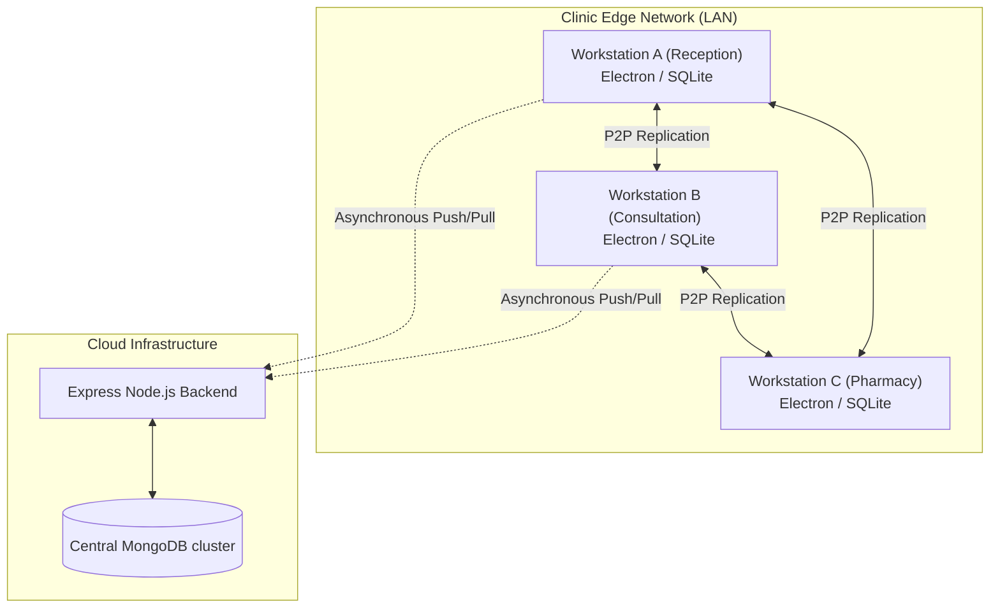

# Project Context: ClinicFlow Platform

ClinicFlow is a resilient, local-first Practice Management System (PMS) designed for clinics. It operates independently of internet connectivity by utilizing a distributed peer-to-peer (P2P) network over the clinic's Local Area Network (LAN), backed by a centralized cloud database for long-term backup and synchronization.

---

## 1. Architectural Strategy



* **Local-First Writes:** Read and write queries interact immediately with local SSD-backed storage (`better-sqlite3`), bypassing external network latency.
* **P2P LAN Synchronization:** Background worker processes poll local subnet peers to replicate new data mutations, making workstation data consistent without internet.
* **Cloud Resilience:** Outages are invisible to the clinic operations. Offline transactions queue up and automatically sync with the Express/MongoDB backend when connectivity is restored.

---

## 2. Directory Layout & Module Structure

```text
medi-saas/
├── backend/                # Cloud Backup Service
│   ├── src/
│   │   ├── config/         # MongoDB and external services configuration
│   │   ├── core/           # Express server setup and middlewares
│   │   ├── modules/        # API endpoints (Auth, Sync, Patients, Doctors, etc.)
│   │   └── server.js       # Entrypoint
│   └── Dockerfile          # Container deployment schema
│
├── frontend/               # Local Edge Runtime (React + Electron)
│   ├── electron/           # Main process and native APIs
│   │   ├── desktop/
│   │   │   ├── api/        # Local Router and IPC API bridges
│   │   │   ├── database/   # SQLite Initialization and Schema Migration
│   │   │   ├── discovery/  # UDP Discovery service for LAN peers
│   │   │   ├── services/   # Local Event Store and Cloud Sync handlers
│   │   │   └── sync/       # LAN P2P synchronization runner
│   │   ├── main.cjs        # Electron bootstrapper and lifecycle manager
│   │   └── preload.cjs     # Context bridge exposing IPC APIs to React
│   └── src/                # React (v19) Render Process
│       ├── components/     # UI shared elements
│       ├── context/        # React Global States (Auth, Connection/Sync status)
│       ├── pages/          # Dashboard, Users, Network, Patients, Appointments
│       └── services/       # IPC api abstraction
│
└── ui/                     # High-fidelity static layouts & design specifications
    ├── clinic-dashboard/
    ├── doctor-dashboard/
    └── apponiment-management/
        ├── DESIGN.md       # Style & components visual guide (Emerald Health)
        ├── code.html       # Prototype layout
        └── screen.png      # Reference mockup
```

---

## 3. Core P2P Logic & Replication

### A. Event-Sourced Storage
State updates are modeled as discrete, immutable events in the local database. The `events` schema holds details:
```sql
CREATE TABLE IF NOT EXISTS events (
  id TEXT PRIMARY KEY,
  node_id TEXT,
  event_type TEXT,
  entity_type TEXT,
  entity_id TEXT,
  payload TEXT,
  version INTEGER,
  logical_clock INTEGER DEFAULT 0,
  created_at DATETIME DEFAULT CURRENT_TIMESTAMP,
  synced INTEGER DEFAULT 0,
  cloud_synced INTEGER DEFAULT 0
);
```
Every mutation (e.g. `PatientCreated`, `AppointmentCreated`) is saved as an event and instantly applied to projection tables (e.g., `patients`, `appointments`).

### B. Conflict Resolution (Lamport Logical Clocks)
To achieve consistency in a distributed ledger without a centralized authority, ClinicFlow implements a Winner-Takes-All conflict resolution mechanism:
1. **Clock Tracking:** Each node updates a local Lamport Logical Clock upon writing events locally, and fast-forwards its clock when receiving remote events.
2. **Deterministic Rules:**
   - **Rule 1 (Logical Ordering):** When a collision occurs (e.g., booking the same doctor slot at the same time), the event with the **lower logical clock** (the one that occurred earliest in causal sequence) wins.
   - **Rule 2 (Tie-Breaker):** If logical clocks match, the event associated with the lexicographically smaller **Node ID** wins.
   - The losing transaction is demoted (e.g., status updated to `'waitlisted'`).

---

## 4. Frontend State & React Contexts

The React interface integrates with the Electron main process using dedicated Context Providers:

### [Auth Context](file:///d:/alok-igt/medi-saas/frontend/src/context/AuthContext.jsx)
Exposes session status:
* Authenticates users via the local IPC bridge (`/auth/login`).
* Loads current user information and sets local tokens in `localStorage`.
* Listens for `'auth_error'` events to trigger automated logout sequences.

### [Connection Context](file:///d:/alok-igt/medi-saas/frontend/src/context/ConnectionContext.jsx)
Monages system networking and sync processes:
* Monitor online/offline states using window navigation hooks.
* Triggers an upstream database sync (`/sync/flush`) when switching to an online state.
* Subscribes to real-time events sent by Electron (`onSyncUpdate`) and fires standard DOM events (`p2p-sync-update`) to signal React components to re-fetch data.

---

## 5. Visual Design System
Guided by the visual specs under `ui/`, the application implements a premium, modern dashboard visual style:
* **Color Palette:** Curated neutral cool slates with **Emerald Green (#10B981)** as the primary theme color. Accent colors include Indigo/Purple and Blue.
* **Aesthetics:** Corporate Modern with glassmorphism (soft blurs, ambient slate shadows, thin light borders) to deliver a polished user experience.
* **Typography:** **Inter** is the primary typography for maximum legibility in high-density data tables, with **JetBrains Mono** reserved for IDs and tracking numbers.
